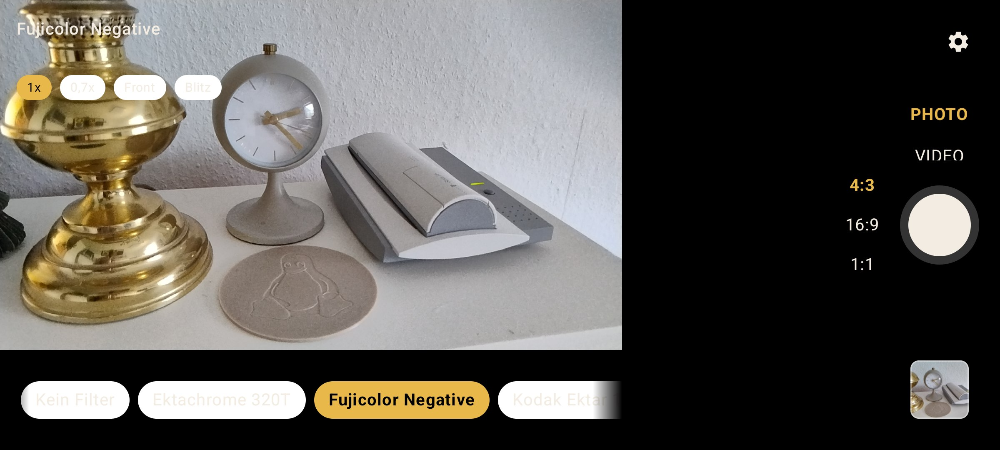
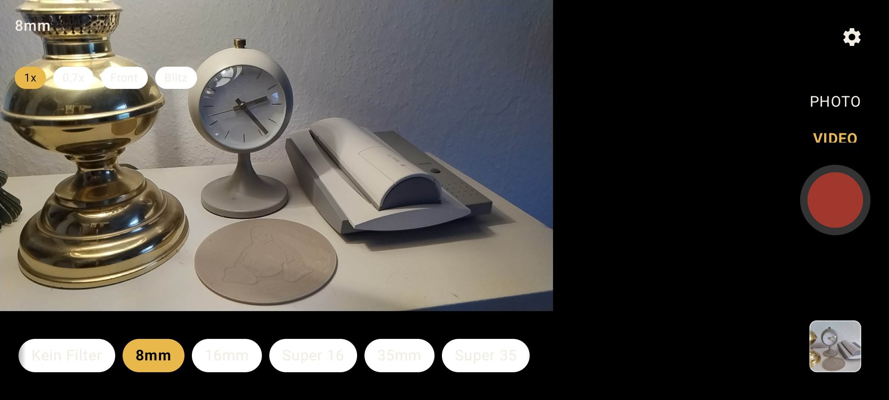
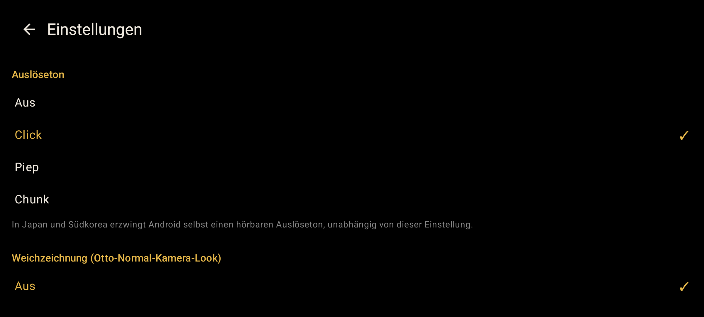
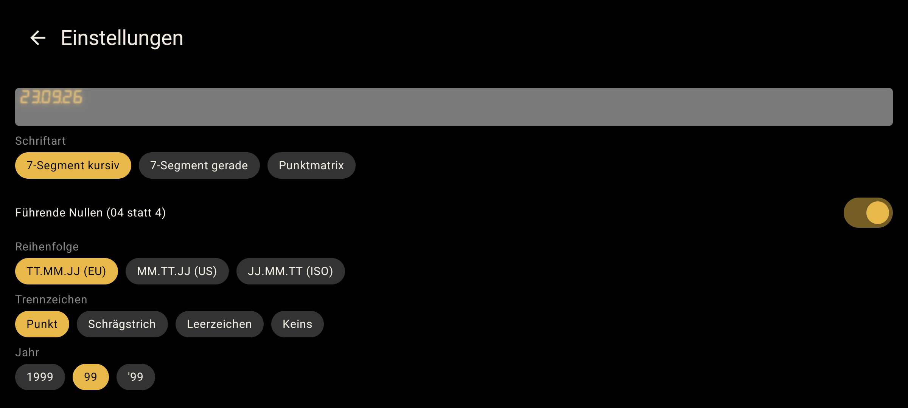

# RetroCam

[](https://github.com/veritasX1/RetroCam/releases/latest) [](https://github.com/veritasX1/RetroCam/releases/latest)

An Android camera app that renders a real film look into every photo and video — applied once, right after capture, against the camera's own full-resolution output, the same way a real viewfinder camera's optical finder never showed you the exact exposed film either.

**Releases & version history:** [GitHub Releases](https://github.com/veritasX1/RetroCam/releases) (each with an installable APK) · [CHANGELOG.md](CHANGELOG.md) for the same history in one place.

## Why this exists

Most "retro filter" camera apps apply a color-grade preset to a digital-clean capture after the shutter fires — you're editing a photo, not shooting film. RetroCam leans specifically on:

- **Real scanned film grain**, not procedural noise — actual extracted grain plates (5 gauges × standard/heavy tiers), not a random-noise shader trying to fake the look.
- **Fuji-recipe-style color grading** for photos (film simulation, dynamic range, white balance shift, highlight/shadow, color chrome effect, grain, clarity — the same parameter set X-series shooters already know from "recipe" culture), and **gauge-based film-stock presets** for video (8mm through 35mm, each with its own grain/color/softness character).
- **A date-back-style stamp**, burned into the pixel data like a real point-and-shoot's LED date back, right down to choosing how the LEDs' light actually composites onto the film underneath (see Blend modes below).
- **Full-resolution capture first, look applied after** — the viewfinder shows the raw feed so `ImageCapture`/`VideoCapture` can each reach the sensor's/encoder's real capability, then the exact same shader that used to run live gets baked into the actual photo or video file, once, offscreen (see Architecture) - it wasn't always built this way; see "Photo & video resolution" under Known issues for why this changed.

It's a personal project, built and iterated on with a physical test device rather than an emulator, prioritizing "does this look and feel like a real camera" over API completeness.

## Screenshots

| Camera screen | Video film stocks |
| --- | --- |
|  |  |

| Settings | Date stamp styling |
| --- | --- |
|  |  |

## Features

### Photo recipes
Fuji-style recipes (film simulation, dynamic range, white balance shift, highlight/shadow rolloff, color, sharpness, high-ISO NR, clarity, grain strength/size, color chrome effect + FX blue) drive a render pipeline (`RenderLook.kt`) that maps these into shader parameters. Built-in recipes are transcribed directly from [fujixweekly.com](https://fujixweekly.com/) (with a source link in each one's notes field) and ship seeded; users can create/edit their own in the recipe editor, with sliders for every numeric parameter instead of typing numbers, and aspect ratio for photos (4:3/16:9/1:1) selectable next to the shutter.

A real recipe's warmth on a Fuji body often comes mostly from the *white balance setting itself* (e.g. a recipe calling for "6600K" is deliberately telling the camera the light is cooler than that, so it over-corrects warmer) rather than the R/B shift dialed in on top of it - `Recipe.toRenderLook()` now parses that (a Kelvin value, or named modes like "Auto (Ambience Priority)") instead of only reading the shift, which was silently leaving several built-in recipes' warmth much weaker than the source recipe's own description and example photos. This is a deliberate approximation for a completely different (non-Fuji, non-X-Trans) sensor and color pipeline, not a color-science match - expect to keep tuning it against real photos rather than treating it as solved.

### Video film stocks
Gauge-based presets (8mm, 16mm, Super 16, 35mm, Super 35) with their own grain intensity/size, warmth, saturation, vignette, highlight rolloff, shadow lift, and softness — tuned so gauge order tracks grain intensity descending (coarser gauge = more grain), which is also what the picker sorts by.

### Real film grain, with Photoshop-style blend modes
Grain isn't generated — it's sampled from real scanned film grain plates (5 gauges × 2 tiers × 6 frames each, extracted from real 4K scans, high-pass filtered and contrast-boosted, stored as grayscale PNGs in `app/src/main/assets/grain/`). A global **Aus/Standard/Heavy** override in Settings lets the grain tier be picked directly instead of only being derived from the active recipe/stock, and applies uniformly to both photo and video. A second setting controls how the grain composites against the image, computed per-pixel in the shader: **Normal** (flat, symmetric), **Multiplizieren**, **Filmkorn** (the physically-motivated default — grain strength scales with `1-luma`, so it reads at full strength in shadows and fades out approaching white, matching how real film/sensor grain actually behaves), and **Leuchtend** (screen-style, lightening only).

### Date/location stamp with Photoshop-style blend modes
A burned-in date and/or location stamp, styled after real camera date-backs (7-segment or dot-matrix LED look, configurable order/separator/year-style/color/corner/typeface). The stamp's blend mode against the photo underneath is configurable — Normal, Darken, Multiply, Lighten, Screen, Linear Dodge (Add), Overlay — the same idea as a Photoshop layer blend mode, so e.g. Linear Dodge gives the stamp a genuinely additive "glowing LED" look instead of just sitting flat on top of the image.

### Flash / torch
A single torch toggle (not per-shot flash) that works the same way for photo and video, only shown when the active camera actually reports a flash unit.

### Live rotation handling
The camera preview and captures track the phone's actual physical orientation (via a raw sensor listener, not just Configuration's coarse portrait/landscape), rebinding the camera pipeline as needed so photos and video come out in the orientation the phone was actually held in.

### Lightweight in-app photo editor
Tapping the last-capture thumbnail (for a photo, not a video) opens a small iOS-Photos-style editor instead of the system viewer: 90° rotate, a draggable/resizable crop rect with aspect-ratio presets (Frei/1:1/4:5/3:4/16:9), and brightness/contrast/saturation sliders with a live preview, saved back over the same file. Not a general editor - no layers, no undo history, just the handful of corrections people actually reach for right after a shot (cancel out and reopen to start over).

## Architecture

- **CameraX** (`androidx.camera`) for camera lifecycle/use-case management (Preview, ImageCapture, VideoCapture) — no custom `CameraEffect`/`SurfaceProcessor` attached to any of them; each binds and captures independently, at whatever resolution the camera actually supports.
- **The look is baked in after capture, not live**, via `LookRenderer`/`ShaderSource.kt` (warmth/tint/saturation/contrast/highlight-rolloff/shadow-lift/grain/softness/vignette, one shared shader source for both paths below) — the live viewfinder shows the raw, un-graded feed, like a real viewfinder/rangefinder camera never showing an exact preview of the exposed film either:
  - **Photos**: `PhotoLookBaker.kt` runs one offscreen GL pass over the captured JPEG at its own full resolution, then `PhotoPostProcessor.kt` burns in the date/location stamp (`Canvas`/`Paint`, blend modes, blur mask filters — needs full 2D drawing control the shader doesn't give it) and EXIF.
  - **Video**: `VideoLookBaker.kt` decodes the recorded file frame-by-frame (`MediaCodec`, hardware AVC decoder with a software-decoder fallback for hardware-session contention — see its comments), re-renders each frame through the same shader into a fresh encoder, and muxes the result back together with the original (untouched) audio track. `VideoPostProcessor.kt` wraps this the same "never touch the original until a full replacement exists" way `PhotoPostProcessor` does for photos.
- **Room** (`RetroCamDatabase.kt`) for user-editable recipes and film stocks, seeded from JSON (`assets/seed/`) on first run.
- **DataStore** (`SettingsRepository`/`Settings.kt`) for app-wide settings (grain override, date/location stamp config, shutter sound, softness, selected camera/recipe/stock, etc).
- **Jetpack Compose** for the whole UI (`ui/`).

This is a deliberate change from the app's original design (a live `CameraEffect`/`SurfaceProcessor` intercepting every frame, so preview/photo/video all matched exactly) — see "Photo & video resolution" below for why.

## Known issues / open work

### Camera-switch crash (open, deep-dived, likely much improved as a side effect, not yet re-verified)
Previously: switching cameras (front/back/any lens) could crash the app with a native `SIGSEGV` (`libgui.so ConsumerBase::abandon()`, called from `SurfaceTexture.release()`, null pointer, fault addr `0x80`) — a race between the old live effect pipeline's GL surface teardown/rebuild (required on every camera switch, since it owned its own `SurfaceTexture`/EGL context) and the camera HAL's own native teardown of the same underlying object. Tried, in order, with partial success each time: removing a forced/timed `SurfaceTexture.release()` fallback, serializing rebinds, disabling camera-switch UI during recording, a CameraX 1.4.0→1.6.2 upgrade, a post-rebind UI interaction lock, forcing `PreviewView` into `COMPATIBLE` mode — none fully closed it.

Since dropping the live effect entirely (see below), there is no longer any custom `SurfaceProcessor`/`SurfaceTexture` for a camera switch to race at all in the normal preview/photo/video path — the root mechanism this whole crash category came from is simply gone from that path. This is a real, structural change, not another mitigation layer, but it hasn't been re-verified with the same stress-test protocol used against the original bug (rapid repeated camera switches) — do that before fully closing this out.

### Photo & video resolution vs. the stock camera app (root cause NOT found, currently accepted as-is)
User-reported (with an independent ChatGPT code review as a second opinion): RetroCam photos looked softer/"more digital" than the stock camera app's. A controlled tripod comparison found a real, measurable cause: RetroCam's `ImageCapture` was landing on **3264×2448** while the stock camera reached the sensor's real **4080×3072**. Extensively investigated and NOT resolved despite ruling out every theory tried:
- Not a `ResolutionSelector` issue (`HIGHEST_AVAILABLE_STRATEGY` and an explicit `Size(4080,3072)` bound both had zero effect).
- Not the live `CameraEffect` (confirmed via CameraX's own `SupportedOutputSizesCollector` debug logging - merely having any effect present in the `UseCaseGroup` truncated the candidate output-size list for every use case in the group, but removing the effect entirely made no difference either).
- Not `VideoCapture`'s presence, nor binding only one capture use case at a time matching the active mode (removed video from the group entirely, then rebuilt the whole binding to only ever attach one of `ImageCapture`/`VideoCapture` at once, matching how a stock camera app behaves - no change either time).
- Not `CAPTURE_MODE_MAXIMIZE_QUALITY` (removed it - no change).
- Not the CameraX version (upgraded 1.5.3 → 1.6.2, a real stable release bump kept regardless - no change).
- Not the camera ID/HAL - confirmed directly via `dumpsys media.camera` that the exact physical camera this app binds (camera ID 0) reports `android.scaler.availableStreamConfigurations` including `[33 4080 3072 OUTPUT]` (a valid JPEG stream config at the sensor's real max) in its own `CameraCharacteristics` - the size is available at the Camera2/HAL level for this exact camera, so this was never a "wrong lens/sensor" issue.
- Not fixable by matching the stock camera app's CameraX backend either: it bundles CameraX 1.7.0-alpha01 and additionally the `camera-camera2-pipe` artifact (a real, alternate Camera2 integration CameraX offers) - but the actual `CameraXConfig.Provider`-facing integration classes needed to opt into that backend (`androidx.camera.camera2.pipe.integration.*`) aren't published to Google's public Maven under any artifact name found so far; `camera-camera2-pipe` itself (which is public) only contains the low-level pipe library, confirmed by inspecting its AAR directly - there's currently no publicly-buildable way to switch this app onto the same backend the stock app uses.

Currently accepted as an unresolved gap - `ImageCapture`/`VideoCapture` still aren't reaching the sensor's true maximum resolution, and the classic CameraX `camera-camera2` backend's own candidate-size computation is confirmed to be the layer responsible (not this app's use-case configuration, not the camera/HAL). The remaining untried lever - a fully separate `bindToLifecycle()` session just for `ImageCapture`, bypassing this backend's candidate computation for the main session entirely - is a bigger, more invasive change than anything tried so far and needs explicit buy-in before attempting.

### Live preview field of view (fixed)
Related, separate bug found the same investigation round: the live viewfinder was visibly "zoomed in" compared to the stock camera app from the same physical position - confirmed via `dumpsys media.camera`'s active streams that `Preview` was negotiating a 4:3 stream (pulled toward `ImageCapture`'s own 4:3 aspect by CameraX's default resolution-selection heuristics, even with no explicit `ViewPort` forcing it), while the actual `PreviewView`/`SurfaceView` fills the full, much wider ~20:9 landscape screen - center-crop scaling to fill that mismatched shape cropped away roughly 40% of the vertical FOV. Fixed by giving `Preview` its own explicit `ResolutionSelector` (`AspectRatioStrategy.RATIO_16_9_FALLBACK_AUTO_STRATEGY`), decoupled from whichever capture use case is active.

Fixing the resolution mismatch alone still left the *display* of that correctly-negotiated 16:9 stream cropped, though - `PreviewView` still filled the entire (wider-than-16:9) screen, so it was still center-crop-scaling a now-correct-aspect image against a still-mismatched view shape. Fully fixed by giving up on filling the screen at all: `CameraScreen.kt` now measures the available space (`BoxWithConstraints`) and sizes the `PreviewView` to its own exact 16:9 (or 9:16 in portrait) box, letterboxed against the edge opposite the controls (left-aligned in landscape, top-aligned in portrait) - the rest of the screen is left as genuine black background instead of being painted over by a cropped image. Zero cropping anywhere now - the live viewfinder always shows the camera's complete, unmodified field of view.

The recipe/film-stock picker itself also moved as part of this: in landscape it's now a horizontally swipeable strip directly under the live image (with a black fade-out on both edges hinting there's more to scroll to), rather than a vertical list squeezed into the right-side black area - that area now just holds the shutter, mode toggle, thumbnail, and (photo mode only) the aspect ratio picker.

### Cinematic Look (3D-LUT color grading)
Inspected OldRoll (a modded APK, architecture study only - no assets or code taken) and 8mm Vintage Camera (iOS) to understand how filter-style camera apps structure their looks: a LUT/overlay stack composited with Photoshop-style blend modes, layered independently of any parametric warmth/saturation/contrast controls. Built the same idea into RetroCam as a standalone "Cinematic Look" selector (Einstellungen → Cinematic Look) - a real 3D color-cube LUT (`.cube`, the DaVinci Resolve/Adobe standard) baked into a 2D tiled texture and sampled in the shader (`ShaderSource.applyLut`, `LutTexture`), at an adjustable strength, independent of and combinable with any Fuji-style recipe or film stock (including "Kein Filter"). Four looks are bundled: Digital to Film, Modern 35mm, Vintage, Bleach Bypass.

## Asset licensing note

The bundled real film grain plates (`app/src/main/assets/grain/`) were extracted from grain scans sourced from tdcat.com. Confirm your own rights/license before redistributing this repository or its assets further.

The bundled Cinematic Look 3D LUTs (`app/src/main/assets/luts/`) are free downloads from [cinecolor.io](https://cinecolor.io/), included with attribution as required by their license - see the "Cinematic Look" section in Einstellungen.

## Building

```
./gradlew assembleDebug
adb install -r app/build/outputs/apk/debug/app-debug.apk
```

`minSdk` 26, built and tested primarily on a physical device (not the emulator) — the whole point of the app is how it actually looks through a real sensor.
